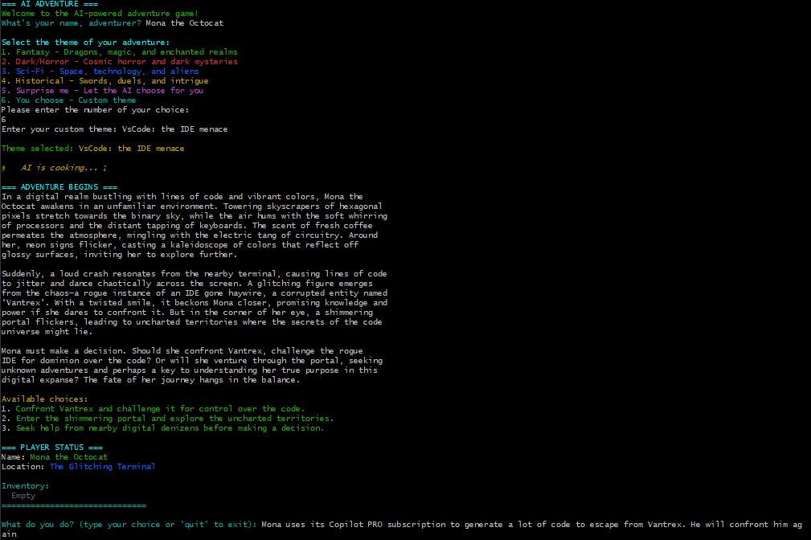

# 🧙‍♂️ AI-Dventure: Interactive AI-Powered Text Adventure Game

Welcome to **AI-Dventure**! 🚀

Embark on a thrilling journey through worlds of fantasy, horror, sci-fi, or history, all narrated by a powerful AI. Your choices shape the story, your inventory grows, and your adventure is unique every time!


Screenshot from initial gameplay

## Features ✨
- **AI Storyteller:** The game uses OpenAI to generate immersive, creative, and unpredictable stories.
- **Dynamic Choices:** At every turn, you can select one of the suggested options or invent your own action to diverge from the main plot. The AI will adapt and continue the story!
- **Inventory & State:** Your items, location, and story summary are tracked and updated as you play.
- **Theme Selection:** Choose your adventure's theme or let the AI surprise you!

## How to Play 🎮
1. **Start the game** and enter your name.
2. **Pick a theme** (fantasy, horror, sci-fi, historical, or surprise).
3. **Read the story** and make your choice:
   - Select one of the numbered options **OR**
   - Type your own action to surprise the AI and take the story in a new direction!
4. **Repeat**: The AI will continue the adventure, updating your inventory and story summary.
5. **Type `status`** to view your current state, or `quit` to exit.


## Example
```
You stand at the gates of a mysterious castle. The wind howls and the moon glows ominously.
1. Enter the castle
2. Walk around the moat
3. Call out for help
> Or type your own action!
```

## Why is it fun? 😄
- **Infinite replayability:** The AI adapts to your creativity.
- **Break the rules:** Don't feel limited by the choices—be bold and invent your own!
- **Surprising twists:** The story can go anywhere, and you are the hero.

## Requirements
- Rust
- OpenAI API key (ENV variable `OPENAI_API_KEY`)

## Command line arguments
The application accepts the following parameters
- `--api-key`: specify custom key if not defined in env
- `--model`: choose OpenAI GPT model (e.g. `gpt-3.5-turbo`, `gpt-4o-mini`, `gpt-4-turbo`, etc.). If not specified `gpt-4o-mini` is used
- 
Example:
```bash
# Run in development mode
cargo run -- --api-key <YOUR_API_KEY> --model gpt-5

# Build a release binary
cargo build --release

# Run the release binary
./target/release/ai_dventure --api-key <YOUR_API_KEY> --model gpt-5
```

## License
[*MIT*](LICENSE)

---
Ready to shape your own legend? 🏰🦄👽
